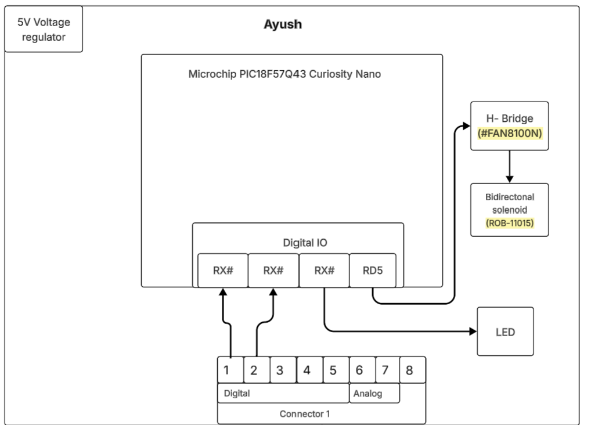

## Overview
The purpose of this block diagram is to illustrate the design and signal flow of the locking mechanism and safety indicator system for the Smart Extension Cord. This subsystem uses the Microchip PIC18F57Q43 Curiosity Nano microcontroller to control a bidirectional solenoid through an H-Bridge driver, enabling automated locking and unlocking of the outlet cover for enhanced user safety.

A LED indicator provides feedback on current flow, ensuring the user knows when the circuit is active or safe to touch. This system is powered by a regulated 5V DC supply and communicates with the main controller through the digital I/O expansion connector. 

* Power Source: 5V DC (regulated)
* Microcontroller: Microchip PIC18F57Q43 Curiosity Nano
* Driver: H-Bridge (FAN8100N)
* Actuator: Bidirectional Solenoid (ROB-11015)
* Indicator: LED
* Communication: Digital I/O via Connector 2

## Block Diagram 
The following image shows my individual block diagram created for the EGR 304 project, illustrating the current sensing and alert system using the PIC18F57Q43 Curiosity Nano microcontroller.

