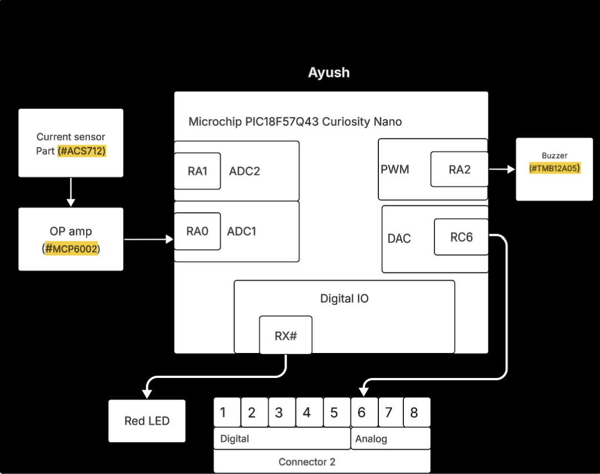

## Overview
The purpose of this block diagram is to illustrate the design and signal flow of a current monitoring and alert system using the Microchip PIC18F57Q43 Curiosity Nano microcontroller.The system is powered through the Curiosity Nano’s regulated 5V USB supply, which also powers the connected sensors and output components.

Power Source:** 5V DC (via USB)  
**Sensor:** ACS712  
**Actuators:** LED, Buzzer  
**Signal Processing:** MCP6002 Op-Amp, ADC/DAC on PIC18F57Q43  
**Communication:** RX line to Connector 2 (digital/analog expansion)

To get some initial formatting help, one can view ["here"](https://embedded-systems-design.github.io/EGR304DataSheetTemplate/Appendix/basic-markdown-examples/) some basic techniques.

## Example Block Diagram 
Showing an example of how to import a screenshot of the block diagram created outside of git and brought into a page.

