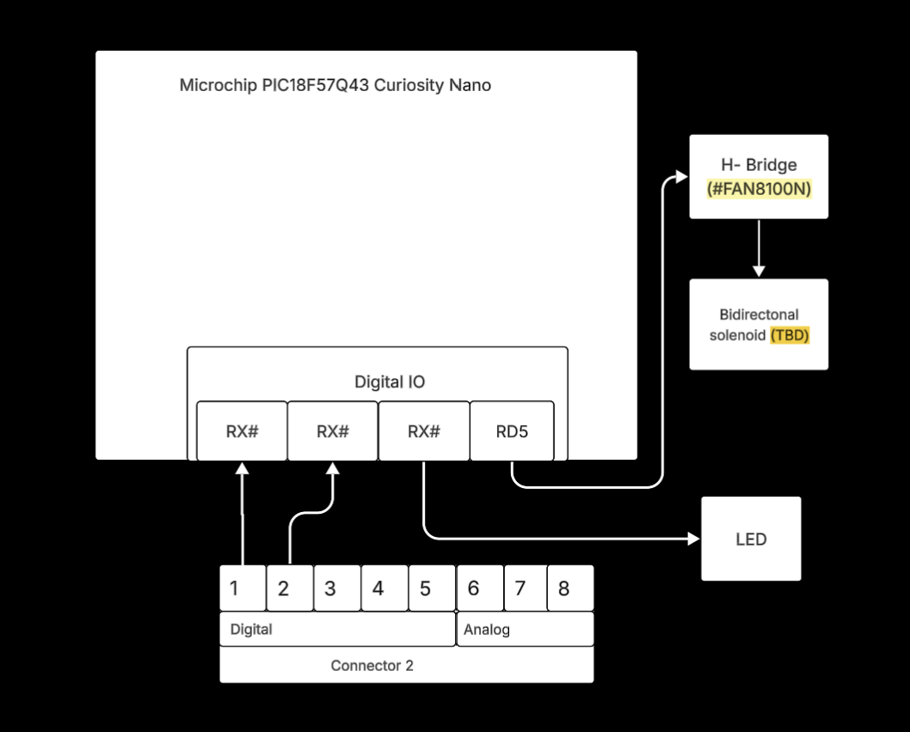

## Overview
The purpose of this block diagram is to illustrate the design and signal flow of a current monitoring and alert system using the Microchip PIC18F57Q43 Curiosity Nano microcontroller.The system is powered through the Curiosity Nano’s regulated 5V USB supply, which also powers the connected sensors and output components.

Power Source:5V DC (via USB)  
Sensor: ACS712  
Actuators:LED, Buzzer  
Signal Processing: MCP6002 Op-Amp, ADC/DAC on PIC18F57Q43  
Communication:RX line to Connector 2 (digital/analog expansion)

## Block Diagram 
The following image shows my individual block diagram created for the EGR 304 project, illustrating the current sensing and alert system using the PIC18F57Q43 Curiosity Nano microcontroller.

