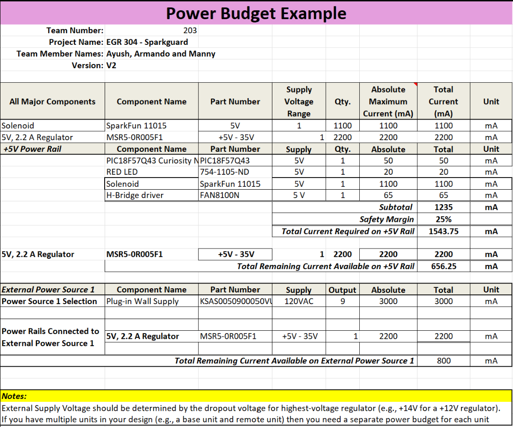

## Overview

The power budget was updated to match the final design components. The total current draw on the +5V rail is 1235 mA, and with a 25% safety margin, the required current becomes 1543.75 mA. Our voltage regulator can supply 2200 mA, leaving about 656 mA of headroom, confirming that the system can operate safely even when the solenoid (largest load at 1100 mA) is active.

{style="width:350px; height:300px;"}

## Conclusions

 Overall, the power budget helped validate that our selected power supply and regulator are sufficient and reliable for the final design.

## Resouces

The power budget as a PDF download is available [*here*](PowerBudgetExample (2).pdf), and a Microsoft Excel Sheet [*here*](PowerBudgetExample (2).xlsx).
